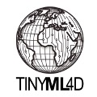

# WALC_2023-Applied_AI

[WALC 2023 - Guayaquil, Ecuador - Track 2 – Inteligencia Artificial Aplicada](https://eslared.net/walc2023/?page_id=241)

## Introduction
Microcontrollers (MCUs) are cheap electronic components, usually with just a few kilobytes of RAM, and designed to consume small amounts of power. Today, MCUs can be found embedded in all residential, medical, automotive, and industrial devices. Over 40 billion microcontrollers are estimated to be marketed annually, and hundreds of billions are currently in service. But, curiously, these devices receive little attention because, many times, they are used just to replace functionalities that older electromechanical systems face in cars, washing machines, or remote controls.

More recently, with the era of IoT (Internet of Things), a significant part of these MCUs is generating "quintillions" of data, which, in their majority, are not used due to the high cost and complexity of their data transmission (bandwidth and latency).

On the other hand, in the last decades, we have witnessed the development of Machine Learning models (sub-area of Artificial Intelligence) trained with "tons" of data and powerful mainframes. But now, it suddenly becomes possible for "noisy" and complex signals, such as images, audio, or accelerometers, to extract meaning from the same through neural networks. More importantly, we can execute these models of neural networks in microcontrollers and sensors using very little energy and extract much more meaning from the data generated by these sensors, which we are currently ignoring. 
> TinyML, a new area of Applied AI, allows extracting "machine intelligence" from the physical world (where the data is generated).

## Overview of the Applied AI Track
The Applied AI Track is an introductory course on the intersection between Machine Learning and Embedded Devices. The spread of embedded devices with ultra-low power consumption (on the order of milliwatts), together with the introduction of machine learning frameworks dedicated to embedded devices, such as TensorFlow Lite for Microcontrollers (TF Lite Micro), allow the mass proliferation of IoT devices empowered by AI (“AioT”).

This course will be divided into two main parts: Fundamentals and Applications. 

## References
+ [Harvard School of Engineering and Applied Sciences - CS249r: Tiny Machine Learning](https://sites.google.com/g.harvard.edu/tinyml/home)
+ [Professional Certificate in Tiny Machine Learning (TinyML) – edX/Harvard](https://www.edx.org/professional-certificate/harvardx-tiny-machine-learning)
+ [Introduction to Embedded Machine Learning - Coursera/Edge Impulse](https://www.coursera.org/learn/introduction-to-embedded-machine-learning)
+ [Computer Vision with Embedded Machine Learning - Coursera/Edge Impulse](https://www.coursera.org/learn/computer-vision-with-embedded-machine-learning)
+ [UNIFEI-IESTI01 TinyML: "Machine Learning for Embedding Devices"](https://github.com/Mjrovai/UNIFEI-IESTI01-TinyML-2023.1)
+ ["Deep Learning with Python" by François Chollet](https://www.manning.com/books/deep-learning-with-python) - [GitHub Notebooks](https://github.com/fchollet/deep-learning-with-python-notebooks)
+ ["TinyML" by Pete Warden, Daniel Situnayake](https://www.oreilly.com/library/view/tinyml/9781492052036/)
+ ["TinyML Cookbook" by Gian Marco Iodice](https://github.com/PacktPublishing/TinyML-Cookbook)
+ ["Technical Strategy for AI Engineers, In the Era of Deep Learning" by Andrew Ng](https://github.com/ajaymache/machine-learning-yearning/blob/master/full%20book/machine-learning-yearning.pdf)
+ ["Python for Data Analysis by Wes McKinney"](https://wesmckinney.com/book/)
+ ["AI at the Edge" book by Daniel Situnayake, Jenny Plunkett](https://www.oreilly.com/library/view/ai-at-the/9781098120191/)
+ ["MACHINE LEARNING SYSTEMS for TinyML" e-book extension from CS249r course at Harvard University](https://harvard-edge.github.io/cs249r_book/)
+ [Edge Impulse Expert Network](https://docs.edgeimpulse.com/experts/)

## Material
- All material will be uploaded to this repo at the classes' base
- Slides, Notebooks, Code, and Docs are majoritarian in English 
- Hands-On sections with the Nicla Vision device (NiclaV) will follow the e-book:

    - https://mjrovai.github.io/TinyML_Made_Easy_NiclaV_eBook/

    

### Day 1 (Fundamentals):

- Artificial Intelligence Overview – J Lopez

- [About the Track & Syllabus](content/01_Applied_AI_2023.pdf) – M Rovai

- Tools Setup - M Rovai

### Day 2 (Fundamentals):

- Introduction to Machine Learning – D Mendez

- Introduction to Neural Networks – D Mendez

    - DNN – Regression

    - DNN – Classification

    - ML Metrics 

- Convolutions – M Rovai
    - Introduction
    - Image Classification using Convolutions (CNN)
        - Hands-On with CoLab

- Preventing Overfitting & DL Wrap-Up – M Rovai

### Day 3 (Applications):
- Edge Impulse Studio – M Rovai
    - Hands-On with EI-Studio

- Embedded ML (TinyML) Intro & Applications – M Rovai

- Computer Vision (CV) Applications – M Rovai

    - Image Classification
        - Hands-On with NiclaV

    - Object Detection)

### Day 4 (Applications):

- Sound Classification – M Rovai 
    - Hands-On with NiclaV

- Motion Classification – M Rovai
    - Hands-On with NiclaV

- Anomaly Detection  – M Rovai
    - Hands-On with NiclaV

### Day 5 (Applications):

- AI Ethics – J Lopez

- Sensor Fusion and Multiple Models – M Rovai

- The future of the Edge AI – M Rovai

- Applied AI Track Wrap-up – M Rovai

WALC 2023 Track 2 is part of the [TinyML4D](https://tinyml.seas.harvard.edu/4D/AcademicNetwork), an initiative to make Embedded Machine Learning (TinyML) education available to everyone, explicitly enabling innovative solutions for the unique challenges Developing Countries face.  